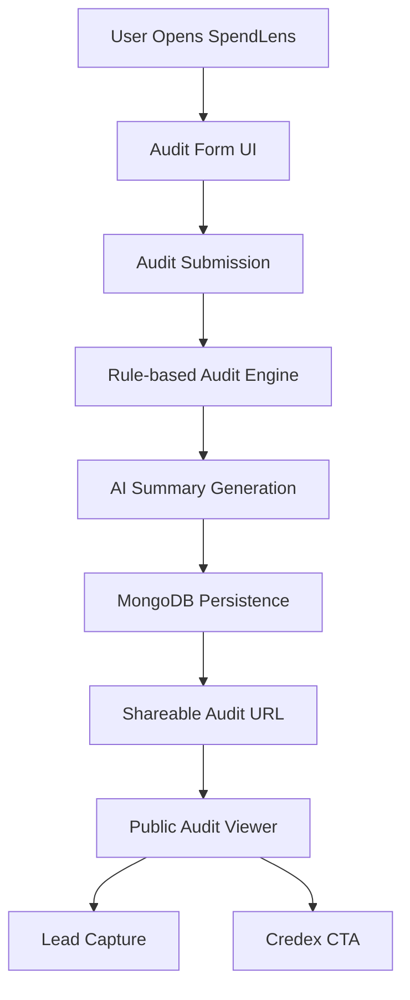
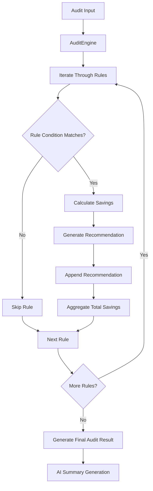

# System Diagram



The overall application flow is intentionally simple.

A user visits the site and fills the audit form with:

- AI tools
- plans
- monthly spend
- seats
- team size
- primary use case

After submission, the request flows into the rule-based audit engine which evaluates pricing efficiency and generates recommendations.

The generated audit result is then passed into an LLM to create a short personalized summary paragraph.

Finally:

- audit data is persisted in MongoDB
- user is redirected to a shareable audit page
- optional lead capture and Credex CTA logic are displayed depending on savings detected

The architecture keeps:

- audit logic deterministic
- AI usage isolated
- persistence simple
- rendering server-driven

---

# Audit Engine Diagram



The audit engine itself follows a rule-based architecture.

Instead of hardcoding one massive nested if-else structure, the engine iterates through isolated rules.

Each rule contains:

- matching condition
- savings calculation logic
- recommendation generation logic

If a rule matches the current audit context:

- estimated savings are calculated
- a recommendation object is generated
- result gets aggregated into final audit output

If a rule does not match, it is skipped.

This approach makes the engine:

- easier to extend
- easier to debug
- easier to reason about
- less fragile compared to giant conditional chains

The engine also uses:

```txt id="m1q8x2"
adoptionRatio = seats / teamSize
```

instead of relying purely on absolute seat counts, because:

- 10 seats in a 12-person team means high adoption
- 10 seats in a 300-person team means low adoption

At the same time, absolute scale still matters in some recommendations, so the final logic combines:

- adoption ratio
- organization scale
- pricing tiers
- tool overlap heuristics

The engine is intentionally deterministic and non-AI-driven because financial recommendations need to remain explainable and debuggable.
